# Audio-Splitter

The Audio-Splitter is a versatile audio device featuring a 4-input selection (including built-in Bluetooth) and 3 output options: 2 stereo RCA outputs and 1 balanced mono output with a switchable low-pass filter.

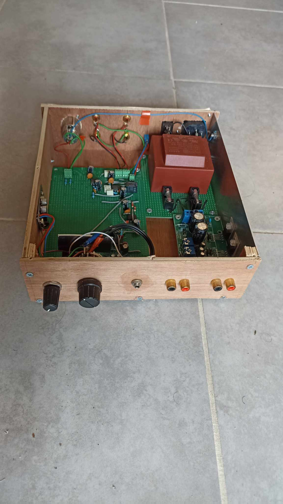

## Objectives

This project aimed to delve into electronics and analog circuits by creating a comprehensive device tailored to my audio system needs. The specifications included:

- A device acting as a preamplifier
- 4 selectable inputs :
  - a built-in Bluetooth module.
  - 2 stereo RCA
  - 1 stereo jack 3.5mm
- 3 outputs :
  - 2 stereo RCA output
  - 1 XLR mono output for a subwoofer (featuring a switchable low-pass filter with a -3dB threshold at 80Hz)
- Default amplification of the input signal with a gain of 5.
- Adjustable input volume
- Complete integration of the power supply (including the transformer and regulation towards two symmetrical 12V outputs plus a continuous 5V output) into the device.

## Power Supply and safety Considerations

The analog circuit is based on operational amplifiers (TL072) requiring a symmetrical power supply. To simplify the task, I decided to use ([a pre-designed symmetrical power supply module](https://www.gotronic.fr/pj2-illustrated-assembly-manual-k8042-2451.pdf)), supplied with components to solder onto a PCB. The output voltage is adjustable between 2 to 24V and requires connection to a double-input transformer. For the transformer part, I chose to integrate a molded transformer with a 2x15VA output into the device.

An important note regarding this choice: integrating a transformer into the device implies that 230V will be present within the device, representing a significant safety risk if safety standards are not followed. My choice was primarily driven by economic reasons; I couldn't find a double-wall transformer with 2x15V at an affordable cost, although it would have been the safest choice.

If one chooses to integrate the transformer into the device, there are two reasonable ways to do it:

- Insulate the entire device with sufficient plastic isolation to fully isolate the circuit from the user, including and especially at the level of adjustment knobs and connectors. In this scenario, it's possible to forego connecting the device to ground. While this scenario won't prevent short circuits, it will protect the user.
- Use a metal enclosure and ensure that all parts likely to be touched by the user are grounded. This scenario minimizes the risk of short circuits since current leaks are more likely to be detected by the circuit breaker in your electrical installation. And even if the leakage is not detected by the circuit breaker, grounding the parts in contact with the user will prevent potentially fatal shocks.

## My design choice

The choice I made does not adhere to either of these scenarios, as I opted to use a wooden enclosure for simplicity of fabrication. However, I took certain precautions in the design of the device:

- The primary part of the circuit where 230V flows is confined to a small space closest to the transformer (the main switch being located next to the power input).
- The PCB on which the transformer is soldered has been modified (by burning the traces) to leave several centimeters of space devoid of conducting elements between the 230V and the user-contact parts.
- The side of the enclosure adjacent to the power input and the transformer is an aluminum plate connected to ground. This plate also serves as a heat sink for the two voltage regulators. The idea is that if cables were to loosen from the terminal, they are likely to come into contact with this edge of the enclosure, thus making it easier for the circuit breaker in the electrical installation to detect a short circuit. The XLR female socket, being metal though relatively far from the 230V, is also connected to ground
- The power input has a built-in 125mA fuse, mainly to protect the equipment from manufacturing errors, as it was changed 5 or 6 times during fabrication.
- The two transformer outputs are also equipped with 1A fuses to protect the entire circuit from excessive current.
- The top of the box is made of a transparent plexiglas

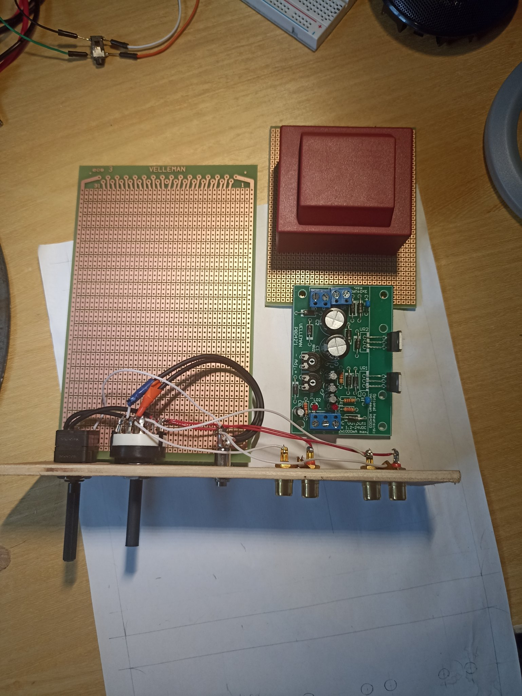
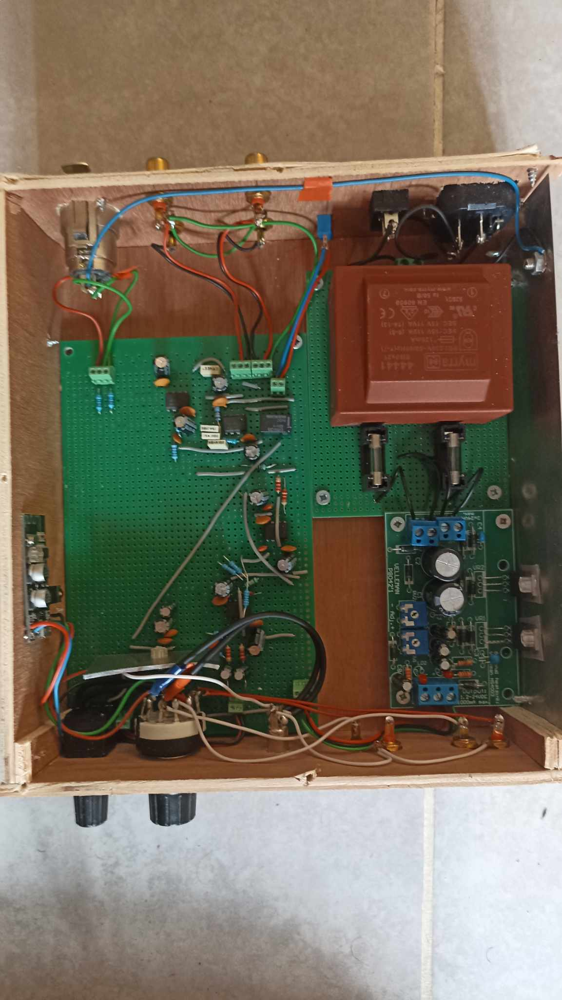

# Circuit details

### Power supply

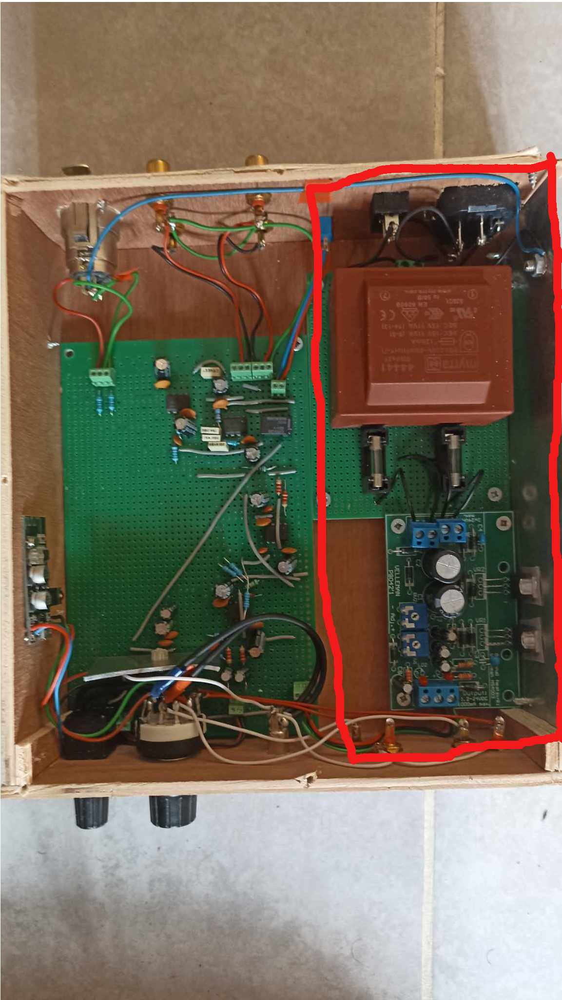
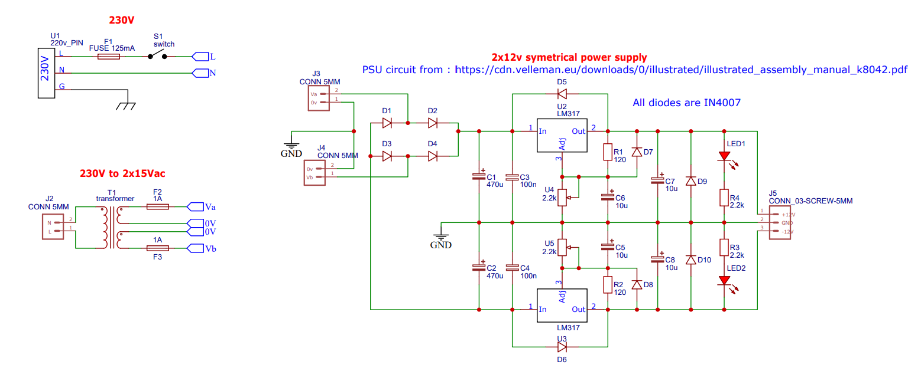
The primary fuse (125mA) is integrated into the mains power socket. The switch output is connected to the transformer PCB via a screw terminal. The aluminum plate forming the right side of the enclosure is grounded, as is the XLR socket. Two 1A fuses are directly connected to the transformer secondary.

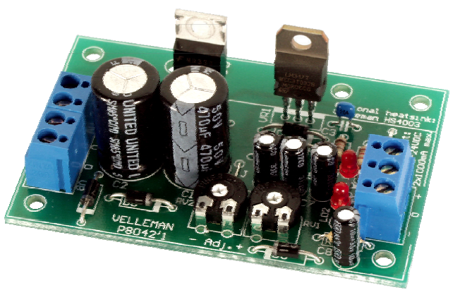

I chose to calibrate the symmetrical power supply module to 12V to avoid having too high a voltage to regulate on the 5V part. I started by soldering the power supply module, which was a good initiation to soldering. One of the potentiometers intended to adjust the output voltage was defective (probably due to my faulty soldering rather than the vendor) and had to be replaced.

The two voltage regulators of the power supply circuit (LM317) generate heat and need to be connected to a heat sink, so I screwed them onto the aluminum plate constituting the right side of the device. However, since this plate is connected to ground, the regulators must be completely isolated from the plate. I used dedicated pads for this purpose, sandwiched between the regulators and the aluminum face, which form an insulating layer while conducting heat, as well as nylon screws and nuts.

*LM-317 connected to the aluminium plate*

It's worth noting that it is also possible to use a virtual ground for the operational amplifiers and thus do away with a symmetrical power supply, but at the risk of losing quality.

### 5V supply

My circuit requires 5V in several places: for the relay that switches the low-pass filter on the mono output and to operate the Bluetooth module. To obtain 5V from my 12V output, I use an L7805 regulator. Transitioning from 12V to 5V can significantly heat up the regulator, so I fashioned a sort of heat sink by cutting an aluminum plate and screwing it onto the regulator. Through some testing, it turned out that powering the Bluetooth module generated a significant parasit buzzing on the audio circuit. One way to drastically reduce this buzzing was to use a small 5V/5V DC transformer allowing relative isolation of the two power circuits. The noise remains audible when the audio input is cut off but is not noticeable during playback.

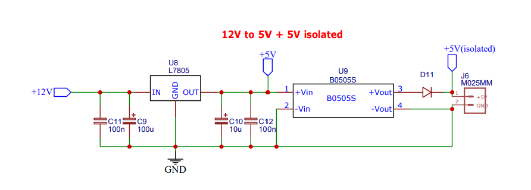

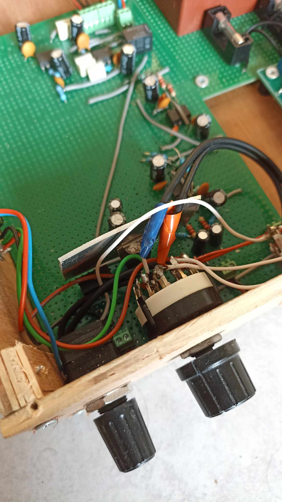
*5V regulator heatsink*

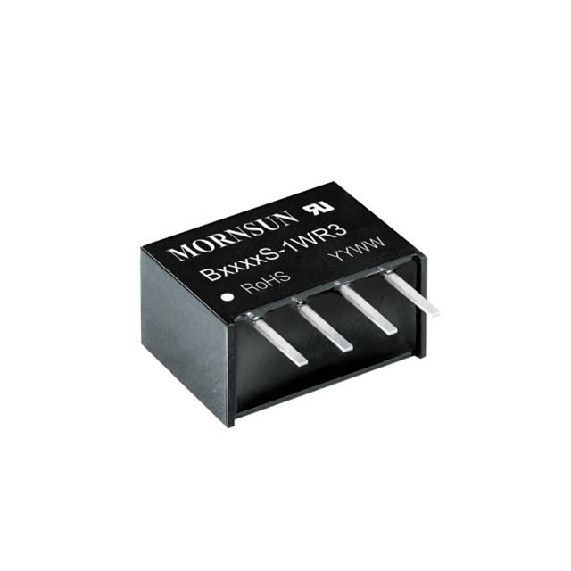
*DC/DC 5V convertor for isolation purpose*

### Audio circuit

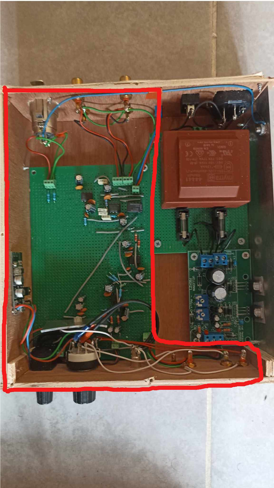
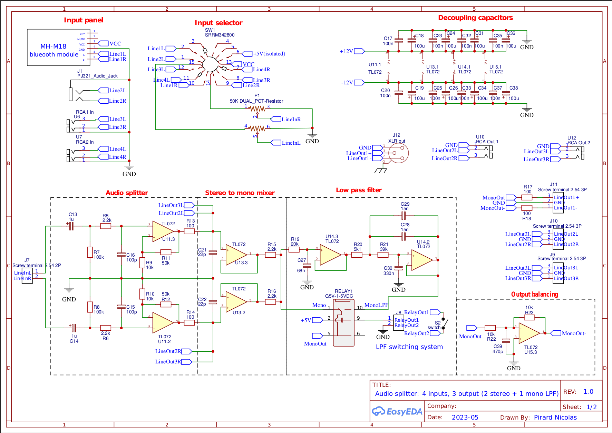
*Full audio circuit*

The analog audio circuit can be divided into 5 stages. The last three stages pertain solely to the mono output intended for a subwoofer.
1. The audio input is switched from 4 possible inputs.
2. The input signal is divided into 3 separate, isolated stereo outputs and amplified with a gain of 5.
3. One of the three outputs is transformed into a mono signal.
4. This mono signal may or may not pass through a switchable low-pass filter.
5. The mono signal is balanced to form a balanced signal to an XLR output.

### Input selection
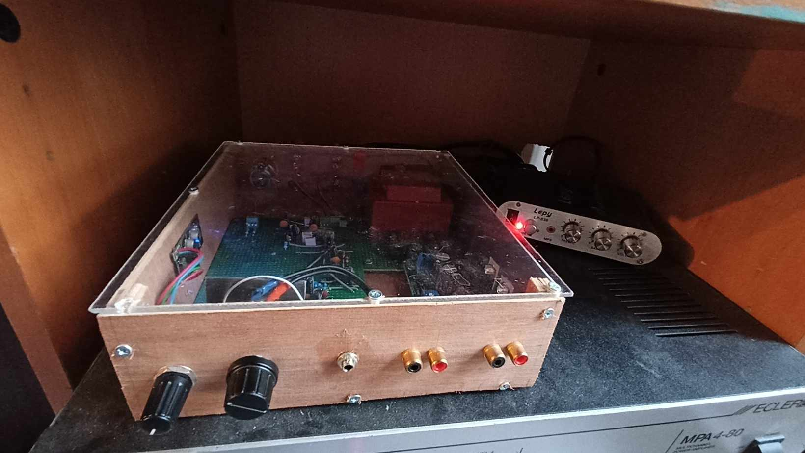
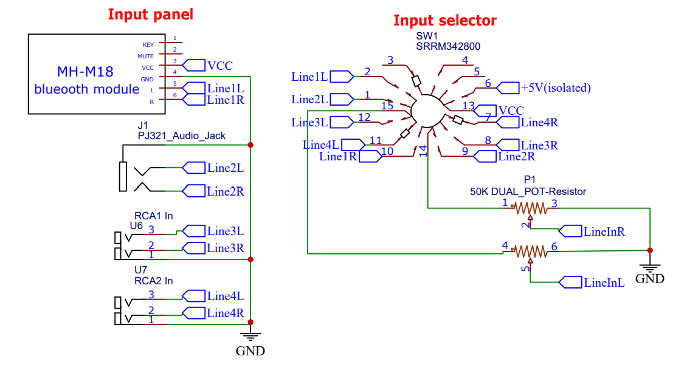
*Input selection*

All audio inputs are located on the front panel of the enclosure. The active input is selected using a 4-position rotary switch controlling 3 distinct circuits. Two circuits are used for the audio signal (left and right) while the third circuit is used to switch the 5V power supply of the Bluetooth module when selected as an input.
The audio outputs of the switch are connected to a stereo potentiometer for input volume control.

#### Audio splitter

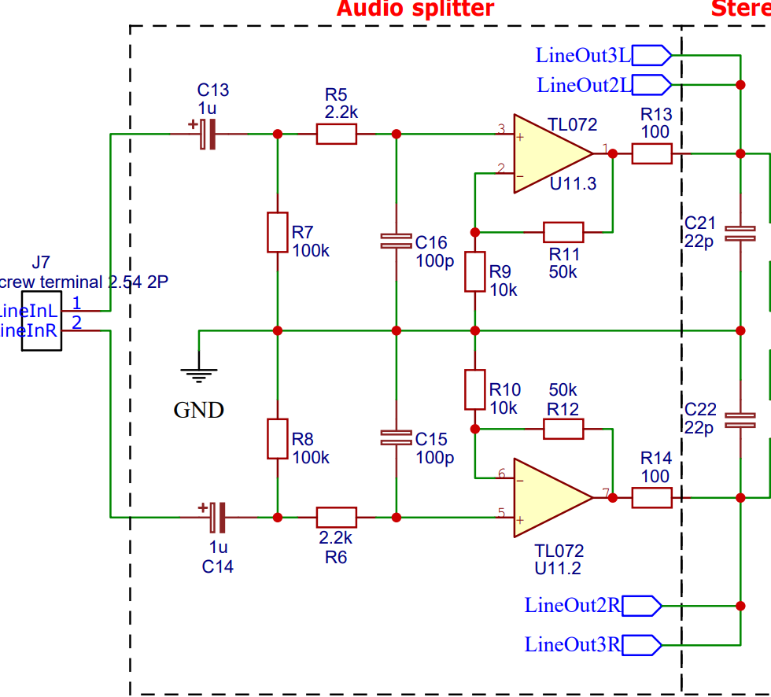
*Audio splitter*

The signal exiting the potentiometer is connected to the input of the PCB constituting the analog circuit via a screw terminal. The signal is divided into three separate stereo outputs.
C13 serves as a coupling capacitor to eliminate any DC offset at the circuit input. R7 limits pops associated with the presence of coupling capacitors.
R5 and C16 are used to reduce noise by limiting high frequencies.
The operational amplifier circuit is a fairly standard non-inverting configuration with R9 and R11 providing a gain of 5.
R13 limits the output signal in case of a short circuit.

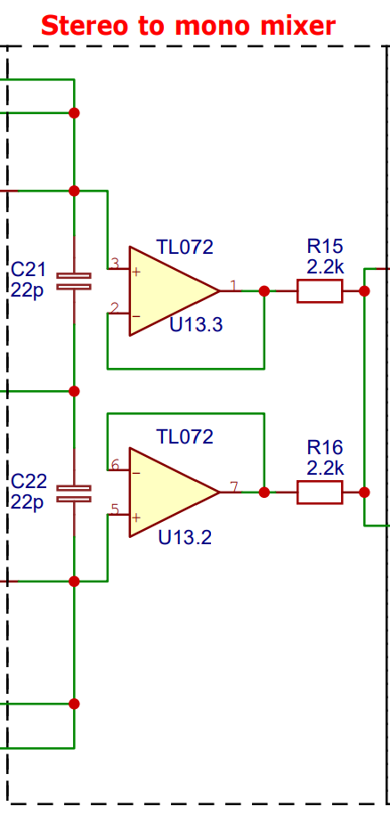
*Simple mono mixer*

The stereo-to-mono mixer is very straightforward; the operational amplifiers are configured as voltage followers and primarily serve to isolate the mono output from the two other stereo outputs. Otherwise, a simple resistor configuration would have sufficed.

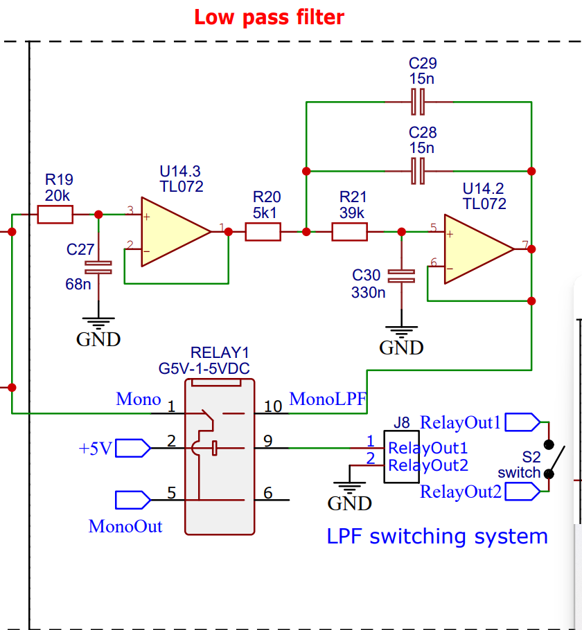
*Low pass filter*

The low-pass filter is a 2nd-order Sallen-Key configuration built from [this site](https://tools.analog.com/en/filterwizard/) and simulated on LTSpice. Since the mono output is intended for a subwoofer, the target cutoff frequency is around 80Hz, but the components were adjusted based on the components I had available.
The output of the low-pass filter can be switched with its input using a relay connected to a switch to disable the low-pass filter if necessary.

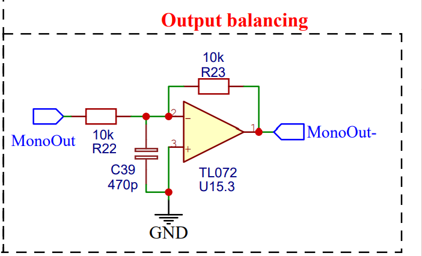

To obtain a balanced output from our mono signal at the LPF output, we simply need to invert it once, as it has already been isolated from the other input signals after passing through the stereo-to-mono mixer. R22 and C39 serve as a filter for high frequencies (not sure if this is really useful given the previous stages). It's an inverting configuration with a unity gain (gain of 1). R17 (see overall schematic) limits the output current in case of a short circuit.

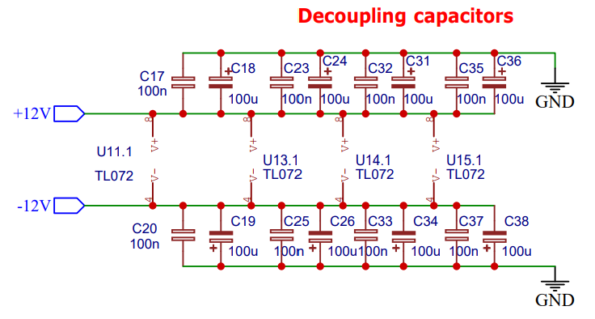

All +12V and -12V inputs of the operational amplifiers are equipped with decoupling capacitors as close to their pins as possible.

## Problems and Improvement Paths

- The audio outputs are not equipped with muting relays, which generate significant parasitic noises when the preamplifier is powered on while the amplifiers are already on.
- Similarly, switching from one input to another results in slight pops.
- The attenuation of the low-pass filter is a bit too light for my taste.
- The overall quality of the box assembly is somewhat low.

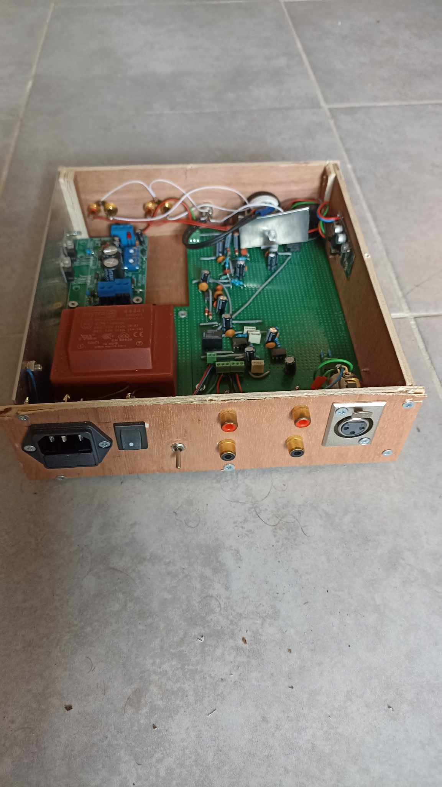

## Sources and acknowledgment

Symmetrical PSU notice: 
https://www.gotronic.fr/pj2-illustrated-assembly-manual-k8042-2451.pdf
https://www.gotronic.fr/pj-7.pdf

I found invaluable guidance and precious advice in this thread on the DIYaudio forum throughout the design process
https://www.diyaudio.com/community/threads/stereo-input-selector-and-3-output-splitter.398242/

This guy's blog is a goldmine of documentation and circuit examples on analog and electronics in general
https://www.sonelec-musique.com/electronique.html